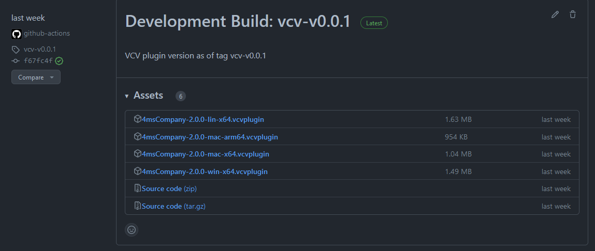
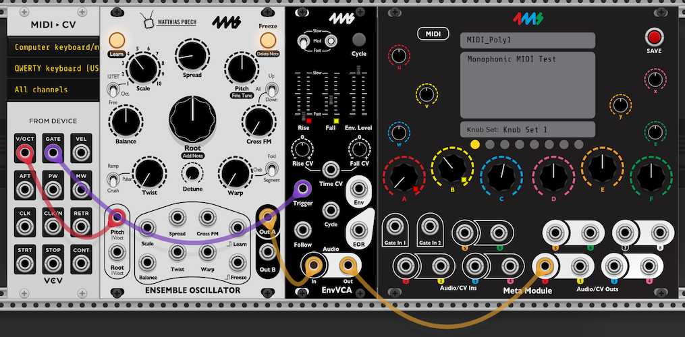
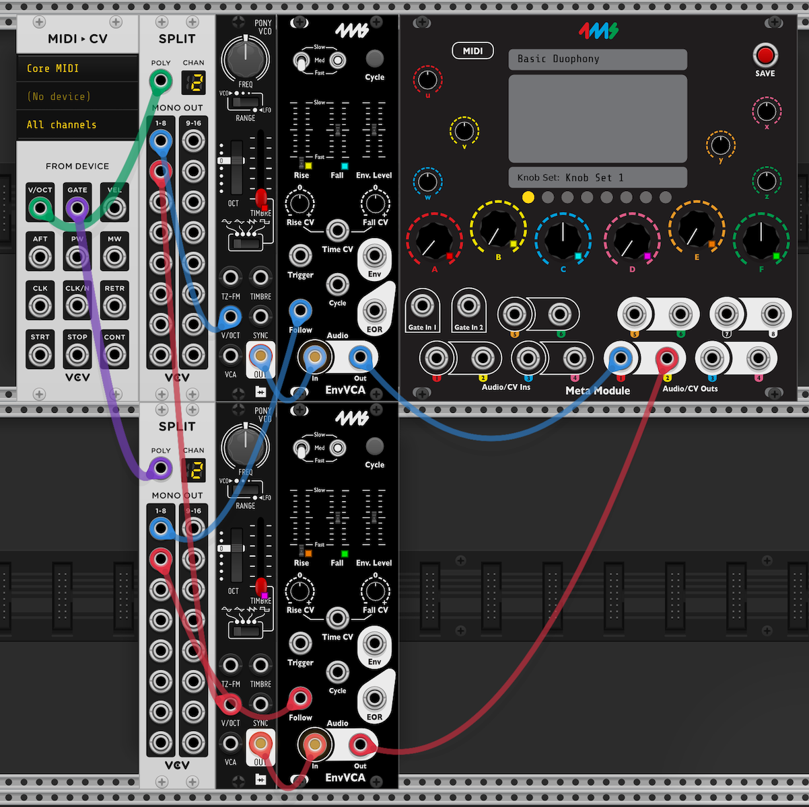

# Creating Meta Module Patches With VCV

### Adding Modules to Your Library
To get started, you will need to add the free 4msCompany Meta Module to your VCV Library. If you aren't familiar with adding modules to your VCV Library, it is an easy process.

#### Via VCV Library (NOT YET AVAILABLE)
1) Go to [the VCV Library](https://library.vcvrack.com/) and make sure that you are signed into your account (top-right corner).
2) On the top of the Library are a number of filters. You can search for "Meta Module" or "4ms". Alternatively, you can use [the 4msCompany Brand Filter](https://library.vcvrack.com/?query=&brand=4msCompany&tag=&license=) to list all modules by 4ms.
3) Aside from the Meta Module, you will want to add modules from other supported brands for creating your patches. Currently, the Meta Module supports modules from 4msCompany, Befaco, HetrickCV, and Nonlinear Circuits, along with the Macro Oscillator by Audible Instruments. (TODO: Add a link to a supported list of modules)
4) To add a module to your account, simply click the "+ Add" text on each module that you wish to have available in your VCV environment.
5) After adding modules to your account, open VCV Rack (or restart it if it's currently open). If you are not signed in to your VCV account on VCV Rack itself, click the "Library" menu on the top file bar and sign in there.

#### Via GitHub Releases
1) Go to the [GitHub Releases Page](https://github.com/4ms/metamodule/releases/).
2) Find the latest VCV (.vcvplugin) release and download the appropriate build for your machine type.
3) Place the .vcvplugin file in your VCV Rack User Folder. To find the User Folder, open VCV Rack, and selected "Open User Folder" from the Help menu.
4) Open VCV (or restart it if it's already open). This will unzip the contents of the .vcvplugin package and install it. The modules should now be visible in your local VCV library.

### Saving the Basic Patch

The 4ms Meta Module acts as the patch creation hub inside of VCV. To add it to your VCV Patch, right click on an empty space in VCV to bring up your module library.

The menu bar at the top of the library can help filter down the list of modules if you have a large library. For instance, you can click the Brand filter and select only 4msCompany modules.

Additionally, you can add modules to your Favorites by control-clicking the mdoule on Windows or command-clicking on Mac. When added to your Favorites, a yellow border will appear around the module.

For the most basic patch, you will need at least two modules: the 4ms Meta Module and a VCV Audio module. The Audio module is used to send signals to your speakers while patching. Additionally, it is needed by most modules in VCV as it establishes a sample rate clock source for audio callbacks. Adding the two modules to your rack will look like this:

It is worth saving this patch so that you can come back to it quickly. Go to File->Save at the top of VCV and save this as something like "MetamoduleTemplate.vcv".

### First Patch: Turning your Meta Module into an Ensemble Oscillator

Finally, let's make some sound! As a fun first patch, let's turn the Meta Module into the excellent 4ms Ensemble Oscillator. Open the Library again, and add the 4ms Ensemble Oscillator to your patch.

We want the oscillator outputs to come out of the hardware Meta Module's outputs. To do this, we will connect the oscillator outputs to Meta Module's 1 and 2 outputs. To hear the oscillator on our computer speakers, we will additionally connect the oscillator to the Audio module. Before doing this, make sure your speakers or headphones are set to a comfortable level, as the signal will be quite loud!

Now that we have an oscillator drone, let's map some controls! To map a control, click the dashed line on the Meta Module knob that you wish to attach to a control. A solid line will appear around the knob to let you know that you are in mapping mode.

Once you are in mapping mode, simply click the knob that you wish to control. A color-coded square will appear on the knob to let you know which knob is mapped. As an example, I will map knob A to the Pitch knob on the Ensemble Oscillator.

If you make a mistake and wish to unmap a knob, right-click on the knob and select "Unmap".

By default, the Meta Module knob controls the entire range of the knob. For instance, turning the Meta Module knob to 3 o'clock will set the corresponding knob to 3 o'clock. To change the range and direction of the mapped knob, right-click the knob on the Meta Module to bring up the Min/Max range.

There are two important (and fun!) notes here:
1) You can set Max to less than Min to make a knob move in the opposite direction compared to the Meta Module knob.
2) You can map a Meta Module knob to multiple knobs and ranges.

Aside from knob mappings, we will also want to add CV control of the Ensemble Oscillator. This can be done by dragging a cable from the software Meta Module's "Audio/CV Ins" section to the Ensemble Oscillator's jacks that you wish to send CV to. After you've created a few connections that you like, fill out the Name and Description fields on the Meta Module.

### Saving and Exporting Your Patch

We can now send this patch to the hardware Meta Module. To export your patch, click the big red SAVE button on the top-right of the software Meta Module's interface. This will bring up a dialogue to save the current patch as a Meta Module-compatible .yml file. Make sure your put the file in a place that you'll remember.

You can now upload the patch to the hardware Meta Module via USB drive or microSD (WiFi is coming later with an expander module).

Copy the .yml patch file to a microSD card or a USB drive. The card or
drive must be formatted as FAT32 or ExFAT. The drive may have multiple partitions,
but only the first FAT partition found will be used. Insert the card
or drive into the Meta Module and in a moment it will appear in the Patch
Selector page (press the Back button repeatedly to get back to the Patch
Selector page). You can open a patch just by selecting it and clicking on it.
Play it by clicking the Play button. Once you have a patch opened or playing,
you are free to remove the microSD card or USB drive -- the patch file is
loaded into memory and will stay there until you open or play another patch.

## MIDI

You can map MIDI events (note pitch, note velocity, CC values, Pitch Bend, etc)
to knobs and jacks. This is done by using the VCV Core MIDI modules (included
with the every VCV Rack installation).

The following modules are supported by the MetaModule:

- MIDI Map 
- MIDI to CV
- MIDI CC to CV
- MIDI Gate to CV
- SPLIT (see Polyphony section below)

To use MIDI, include any these modules in your patch and connect cables
normally (monophonically). Use the MIDI "learn" features of these modules to
set CC or note numbers, just like you would if making a VCV Rack patch.

For example, create a patch in VCV Rack with an Ensemble Oscillator OUT A going
to an ENVVCA Audio In. Then patch the ENVVCA Audio Out to the Meta Module's Out
1 jack. Adjust the ENVVCA sliders and switches so that it plays "notes" at a
reasonable tempo when you have the ENVVCA Cycle button on. Now, turn Cycle off
and add a MIDI-CV module to the patch. Patch the Voct output to the Ensemble's
Pitch input, and patch the Gate output to the ENVVCA's Follow input. Map
whatever knobs you want to the Ensemble and ENVVCA's controls.

Right-click the MIDI-CV module and select monophonic for the polyphony channels
setting. 

Now, transfer the patch to the Meta Module and attach a USB-MIDI keyboard to
the USB-C jack. Playing notes on the MIDI keyboard should play them in your
patch.

### MIDI to CV module

This module handles a variety of things, most of which function the same on the MetaModule as they do in VCV Rack.

Polyphony is the major difference (see below). The polyphonic outputs are:
- Voct
- Gate
- Vel (velocity)
- Aft (aftertouch)
- Ret (retrigger)

The Polyphonic Mode right-click menu option has no effect, but an algorithm
similar to Rotate is used. There are differences, however, and the MetaModule
algorithm will likely improve over time.

MIDI Divided clock is handled the same, and the right-click menu option for it
will work to select the division number. The MetaModule supports any integral
division number from /1 to /96, but there is currently no GUI interface to
choose a division number other that what the MIDI to CV module offers (you must
manually edit the patch yaml file).

MIDI Channels are ignored, all events on all channels are forwared to modules.
This will likely change in future versions.

No smoothness algorithms are used currently

### Polyphony

Currently, polyphony of MIDI note events up to 8 voices is supported, but
polyphonic cables are NOT supported by MetaModule. So to create a polyphonic
MIDI patch, multiple VCO/EG/VCA/voice modules must be used with the SPLIT
module in order to convert each polyphonic cable into a set of monophonic
cables. 

Patch the MIDI to CV module's Voct output jack to a SPLIT module, and then patch the 
individual SPLIT outputs to the multiple VCO V/oct inputs (or whatever modules you 
want to be controlled by MIDI notes).

Do the same thing for Gate, Vel, Aft (aftertouch), and/or Ret (retrigger) outputs.

Notice that the only polyphonic cables (thick cables, as drawn by VCV Rack) are
between the MIDI to CV module and the SPLIT module -- all other cables are
monophonic. This is the only way that the MetaModule will recognize polyphoinc
MIDI. If you were to patch the polyphonic output of the MIDI to CV module
directly to the V/oct input of a VCO (even if that VCO is polyphonic), the
MetaModule will interpret that as a monophonic signal. Future versions of MetaModule
firmware may support polyphonic cables, but currently only monophonic cables 
are supported (with the single exception of polyphonic cables patched directly
from a MIDI to CV module to a SPLIT module).

Here's an example patch showing Duophonic MIDI:

### Caveats and limits

Besides polyphonic cables not being supported, there are a few other limits:

- A patch may contain multiple dfferent MIDI modules, but only zero or one of
  each type. That is, a patch may have one MIDI to CV module and one MIDI Map
  module, but it cannot have two MIDI to CV modules. If there are multiple instances
  of a particular type of MIDI module, the results may be odd and is subject to change.

- The polyphony number is set by the right-click menu option on the MIDI to CV 
  module. The number of cables patched into a connected SPLIT module does NOT 
  set the polyphonic number. This is also how VCV Rack works, but may not be
  obvious if you are not experienced with MIDI in VCV Rack. This fact can be
  exploited to make non-standard behaviors such as making only every Nth note
  fire an envelope, for example.

- MIDI output is not supported. Any CV to MIDI, Gate to MIDI, or CV to MIDI CC
  modules will be ignored.

- The settings in the right-click menu for all MIDI moduels are currently ignored,
  except for the polyphony setting of the MIDI to CV module. This will probably change
  as more features are added to MetaModule MIDI. Likewise the MIDI Driver, MIDI
  Device, and MIDI Channel settings of the MIDI modules are also ignored.

- The MetaModule can power a USB device up to 500mA, so if your device needs
  more than that, you will need to power it separately.

