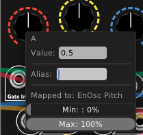

# Creating Meta Module Patches With VCV

### Adding Modules to Your Library
To get started, you will need to add the free 4msCompany MetaModule to your VCV Library. If you aren't familiar with adding modules to your VCV Library, it is an easy process.

1) Go to [the VCV Library](https://library.vcvrack.com/) and make sure that you are signed into your account (top-right corner).
2) On the top of the Library are a number of filters. You can search for "MetaModule" or "4ms". Alternatively, you can use [the 4msCompany Brand Filter](https://library.vcvrack.com/?query=&brand=4msCompany&tag=&license=) to list all modules by 4ms.
3) Aside from the MetaModule, you will want to add modules from other supported brands for creating your patches. Currently, the MetaModule supports modules from 4msCompany, Befaco, HetrickCV, and Nonlinear Circuits, along with the Macro Oscillator by Audible Instruments. (TODO: Add a link to a supported list of modules)
4) To add a module to your account, simply click the "+ Add" text on each module that you wish to have available in your VCV environment.
5) After adding modules to your account, open VCV Rack (or restart it if it's currently open). If you are not signed in to your VCV account on VCV Rack itself, click the "Library" menu on the top file bar and sign in there.

### Saving the Basic Patch

The 4ms MetaModule acts as the patch creation hub inside of VCV. To add it to your VCV Patch, right click on an empty space in VCV to bring up your module library.

The menu bar at the top of the library can help filter down the list of modules if you have a large library. For instance, you can click the Brand filter and select only 4msCompany modules.

Additionally, you can add modules to your Favorites by control-clicking the mdoule on Windows or command-clicking on Mac. When added to your Favorites, a yellow border will appear around the module.

For the most basic patch, you will need at least two modules: the 4ms MetaModule and a VCV Audio module. The Audio module is used to send signals to your speakers while patching. Additionally, it is needed by most modules in VCV as it establishes a sample rate clock source for audio callbacks. Adding the two modules to your rack will look like this:

It is worth saving this patch so that you can come back to it quickly. Go to File->Save at the top of VCV and save this as something like "MetamoduleTemplate.vcv".

### First Patch: Turning your MetaModule into an Ensemble Oscillator

Finally, let's make some sound! As a fun first patch, let's turn the MetaModule into the excellent 4ms Ensemble Oscillator. Open the Library again, and add the 4ms Ensemble Oscillator to your patch.

We want the oscillator outputs to come out of the hardware MetaModule's outputs. To do this, we will connect the oscillator outputs to MetaModule's 1 and 2 outputs. To hear the oscillator on our computer speakers, we will additionally connect the oscillator to the Audio module. Before doing this, make sure your speakers or headphones are set to a comfortable level, as the signal will be quite loud!

Now that we have an oscillator drone, let's map some controls! To map a control, click the dashed line on the MetaModule knob that you wish to attach to a control. A solid line will appear around the knob to let you know that you are in mapping mode.

Once you are in mapping mode, simply click the knob that you wish to control. A color-coded square will appear on the knob to let you know which knob is mapped. As an example, I will map knob A to the Pitch knob on the Ensemble Oscillator.

If you make a mistake and wish to unmap a knob, right-click on the knob and select "Unmap".

By default, the MetaModule knob controls the entire range of the knob. For instance, turning the MetaModule knob to 3 o'clock will set the corresponding knob to 3 o'clock. To change the range and direction of the mapped knob, right-click the knob on the MetaModule to bring up the Min/Max range.

There are two important (and fun!) notes here:
1) You can set Max to less than Min to make a knob move in the opposite direction compared to the MetaModule knob.
2) You can map a MetaModule knob to multiple knobs and ranges.

Aside from knob mappings, we will also want to add CV control of the Ensemble Oscillator. This can be done by dragging a cable from the software MetaModule's "Audio/CV Ins" section to the Ensemble Oscillator's jacks that you wish to send CV to. After you've created a few connections that you like, fill out the Name and Description fields on the MetaModule.

### Saving and Exporting Your Patch

We can now send this patch to the hardware MetaModule. To export your patch, click the big red SAVE button on the top-right of the software MetaModule's interface. This will bring up a dialogue to save the current patch as a MetaModule-compatible .yml file. Make sure your put the file in a place that you'll remember.

You can now upload the patch to the hardware MetaModule via USB, WiFi, or MicroSD.

#### USB
TODO

#### WiFi
TODO

#### MicroSD
Copy the .yml patch file to the MicroSD card on your MetaModule. If you are a MetaModule developer, use a regular microSD card for this instead of the developer microSD card, otherwise the patch won't be visible.

