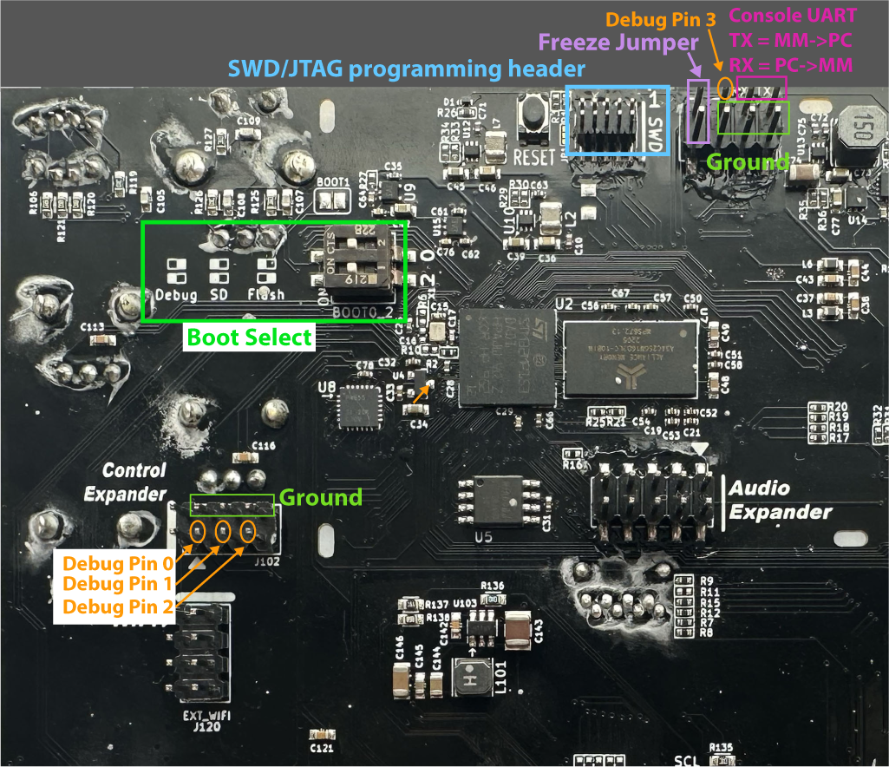

# Debugging 

1) Attach a JTAG debugger to the 10-pin connector at the top of the module labeled
"SWD". The protocol is actually JTAG, despite the header's name, though SWD may
work since the only difference is the tRST pin instead of NRST.

2) Install a "Freeze jumper" on `Control Expander` header that bridges the top-left pin
and the pin just to the right of it. Make sure you use the right header, it's
the one above the Wifi header, near the `y` and `z` pots. The jumper should be
horizontal, not vertical, on the top row of pins all the way to the left:

```
  Control
 Expander
          [====] o  o 
           o  o  o  o
```

See image above for reference.

3) Power off and back on (full power-cycle is required).

The console will show:

```
Freeze pin detected active: booting from DDR
Please load a multi-uimg binary into an address in DDR RAM.
Then write the address to the TAMP_BKP6 register at 0x5C00A118
System will hang until TAMP_BKP6 register is changed...
```

At this point you can choose to debug with gdb, Segger Ozone, VSCode, or TRACE32.
Skip to the relevant section below:

## GDB

First, you need to start a gdb server. Either openocd (v0.12.0) or Segger JLinkGDBServer
(v7.92) are known to work.


For openocd, run this in a separate terminal window to launch openocd:

```
make start-openocd
```

For JLinkGDBServer, run this in a separate terminal window to launch the gdb server:

```
make start-jlinkgdb
```

This command expects the Jlink GDB executable to be `JLinkGDBServer`. If that's not the case
on your system, adjust the following command and use it instead. You also may need
to adjust the USB port and speed settings.

```
JLinkGDBServer -select USB=0 -device STM32MP15xx_A7 -endian little -if JTAG -speed 25000 -noir -noLocalhostOnly -nologtofile -port 3333
```

Or, you can launch the JLinkGDBServer GUI program. Choose JTAG for the
interface, and set the port to 3333 manually (by default it's 2331). Note: if
want to use a different port than 3333, you can change the first line in the
gdbscript (see next step).

Now that the gdb server is running in a separate terminal window, start
debugging using arm-none-eabi-gdb.

```
make debug
```

This will run launch arm-none-eabi-gdb and run the `multi.gdbinit` script. The
script is very short and you should inspect the contents if anything is not
working. All it does is connect to the gdb server at port 3333, and then loads
the symbols from the A7 elf file to gdb (not to the MetaModule). Then it loads
the multi-uimg file (`build/main.uimg`) to an arbitrary address, 0xC0000000.
Finally, it notifies the bootloader to start parsing the multi-uimg file by
writing 0xC0000000 to a designated register (the TAMP_BKP6R register).

The loading may take a while, depending on the debugger hardware (ST-LINK or JLink),
and the binary size (i.e. whether you compiled the full binary or limited it with
`make limit LIMITFILE`).


## Ozone

Instead of using command-line gdb, you can also use Segger's Ozone GUI program.
Ozone 3.28d is known to work.

Open Ozone and load the project file `flashing/metamodule.jdebug`

After power-cycling with the Freeze jumper installed, click the green "Power" icon,
or select "Download & Reset Program" from the Debug > Start Debug Session menu.
Note that this will not actually reset the program since the reset behavior has been
overridden via the project file.

## TRACE32

Lauterbach TRACE32 can be used to debug as well.

After power-cycling with the Freeze jumper installed, run the
`flashing/mm-a7-t32.cmm` script to load the firmware and symbols.

Both A7 cores can be accessed (use the command `Core 0` for the main core, or
`Core 1` for switch to the secondary A7 core). To debug the M4 core, you can
use the `flashing/switch-to-m4.cmm` script.


## Using VSCode

VSCode can be used to debug, using OpenOCD or JLinkGDBServer.

An example `launch.json` file is in the `flashing/vscode-example/` directory.
Put this file into your `.vscode` directory, or otherwise merge its contents
with your existing `launch.json` file. You will probably want to customize this
configuration file, but it should work as-is.

After rebooting with the Freeze jumper installed, start a debugging session,
and it will load the firmware and then break at main.

The Cortex-Debug plugin is required. The example configuration is for Jlink,
but Cortex-Debug also works with openocd. See the [Cortex-Debug
wiki](https://github.com/Marus/cortex-debug/wiki) for details.


## GPIO pin debugging (pin flipping)

You can toggle some GPIO pins to indicate states from firmware with minimal
impact on firmware timing. Typically you would read the pins using an
oscilloscope or logic probe.

There are 6 header pins and two SMD pads on the PCB dedicated to this. They can
be used like this:

```
#include "debug.hh"   // Found in firmware/src/medium/

Debug::Pin0::high();
Debug::Pin0::low();
Debug::Pin1::set(true); //same as ::high()
Debug::Pin1::set(false); //same as ::low()
```

The pins and pads are located on the PCB as shown here:



## Console output (printf debugging)

You can view the console output by connecting a USB-UART cable to the TX pin of
the debug header (next to the SWD header). The TX pin is labeled (upper-right
pin). The bottom four pins are all GND. Settings are 115200, 8N1. See image above.

Use `pr_dbg()`, `pr_warn()`, `pr_err()`, and `pr_trace()` for debug output. These
require the `pr_dbg.hh` header.

Make sure to set the console log level equal or lower to what you want to see. The levels are:

- NONE (no console output)
- ERROR (pr_err only)
- WARN (pr_warn and above)
- INFO (pr_info and above)
- DEBUG (pr_dbg and above)
- TRACE (pr_trace and above)
- DUMP (pr_dump and above)

To set the log level, configure with cmake like this:

```
cmake --fresh --preset full -G Ninja -DLOG_LEVEL=TRACE
```

The convention for each level is as follows:

- Error: unexpected conditions that may lead to program failure
- Warnings: conditions that deserve attention but do not lead to program failure
- Info: Important or useful information that is neither a warning or error
- Debug: temporary messages used for debugging
- Trace: detailed log of execution
- Dump: large amounts of verbose data

Debug (pr_dbg) is particularly useful to use ONLY when debugging. Then, when the
feature is ready to merge, it's easy to search for pr_dbg and remove all
instances (or selectively replace with a more suitable level).
This technique reduces clutter in the console as we continually add features.


## Notes

### Startup

Note: If you are familiar with flashing Cortex-M series MCUs, you will notice
some differences. One is that Flash is on an external chip. Another difference is
that the main RAM (DDR RAM) is not available until software initializes it. The
on-board NOR Flash chip has a bootloader installed
([MP1-Boot](https://github.com/4ms/mp1-boot), which is the FSBL or "first-stage
bootloader"). The bootloader is loaded by the BOOTROM on power-up. MP1-Boot is
responsible for initializing the DDR RAM peripheral. Obviously, this must be
done before loading the firmware into DDR RAM. So, unlike a Cortex-M chip, you
must run a bootloader before programming the device. However, one of the first
things an application does when it starts running is to enable the MMU and
setup various memory regions, some of which are not writable. Thus, the only
time in which it's possible to load firmware to RAM is after the bootloader has
initialized RAM but before the application has started. To handle this,
MP1-Boot has a "Freeze pin" option. When this pin is detected low (jumper is
installed), then MP1-Boot will halt execution (freeze) after initializing RAM.
It'll stay halted until it detects something written to the TAMP_BKP6R
register. At that point, it will try to load a multi-uimg file from the address
written to this register. If the multi-uimg contains an entry point, it will
start executing from that point after loading.

### Multi-uimg format

The multi-uimg format is what's used for the firmware binary. This is just a
series of uimg files concatenated to each other. Each uimg section is a 64
byte header (same header as in U-Boot's uimg format), immediately followed by
the binary data. The header says how big the image is, where it should be
loaded, and optionaly where to start execution.
The multi-uimg file is generated from the M4 and A7 .elf files with the 
`flashing/elf_to_uimg.py` and `flashing/uimg_header.py` scripts.


### Multi-core debugging

Debuggers have a hard time handling multiple cores. Halting one core when
debugging (to examing a variable, for example) could cause another core to
time-out and the application will not run properly when you continue.
