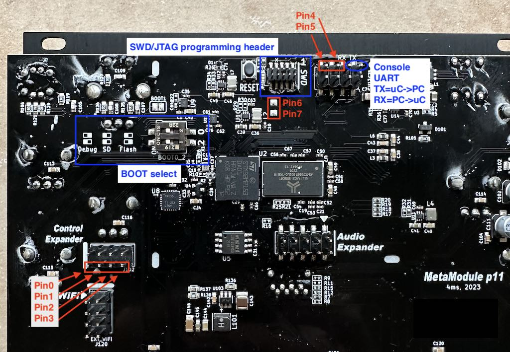

## Debugging with gdb and OpenOCD or JLinkGDBServer 


Connecct an ST-LINK or J-Link programmer to the 10-pin JTAG/SWD header on the PCB.

If you want to use OpenOCD, run this:

```
openocd -f board/stm32mp15x_dk2.cfg
```

Alternatively, you can run JLinkGDBServer and then select the STM32MP15x Core A7 as the target.

```
TODO: command?
```


In another terminal window, run this command (from the project directory):

```
arm-none-eabi-gdb -f build/mp1corea7/medium/main.elf
```

From the gdb prompt, type: 

```
target extended-remote localhost:3333
load
```

The port number (3333) may be different for you, check the output of openocd or JLinkGDBServer
to see what port it's listening on. There may be a different port for each core.

Remember, any file you load using a debugger will only get loaded into RAM. As
soon as you power down, it will be lost.

## Debugging with Segger Ozone (OSD32 board only)


This requires a J-Link debugger. Within Ozone, create a new project for the
STM32MP15xx Core A7, and load the elf file `build/mp1corea7/medium/main.elf`.

Make sure the Control Expander "freeze" jumper is installed, as described in
[firmware-loading](firmware-loading.md)

After re-compiling, power cycle before loading the new .elf file. The Freeze jumper
makes this possible.

## GPIO pin debugging (pin flipping)

You can toggle some GPIO pins to indicate states from firmware with minimal impact on firmware timing.
Typically you would read the pins using an oscilloscope or logic probe.

There are 6 header pins and two SMD pads on the PCB dedicated to this. They can be used like this:

```
#include "debug.hh"   // Found in firmware/src/medium/

Debug::Pin0::high();
Debug::Pin0::low();
Debug::Pin1::set(true); //same as ::high()
Debug::Pin1::set(false); //same as ::low()
```

The pins and pads are located on the PCB as shown here:



## Console output (printf debugging)

You can view the console output by connecting a USB-UART cable to the TX pin of
the debug header (next to the SWD header). The TX pin is labeled (upper-right
pin). The bottom four pins are all GND. Settings are 115200, 8N1.

Use `pr_dbg()`, `pr_warn()`, `pr_err()`, and `pr_trace()` for debug output. These
require the `console/pr_dbg.hh` header.


## Using VSCode

VSCode can be used to debug, using OpenOCD and gdb.


Some configuration files (for the mp1 bootloader, so they will need to be adapted to MetaModule):
[here](https://github.com/danngreen/stm32mp1-baremetal/tree/vscode/bootloaders/mp1-boot/.vscode)
and [here](https://github.com/kamejoko80/stm32mp1-baremetal-1/tree/vscode/bootloaders/mp1-boot/.vscode)

And also [some discussion:](https://github.com/4ms/stm32mp1-baremetal/issues/20)

TODO: Adapt this to MetaModule.
